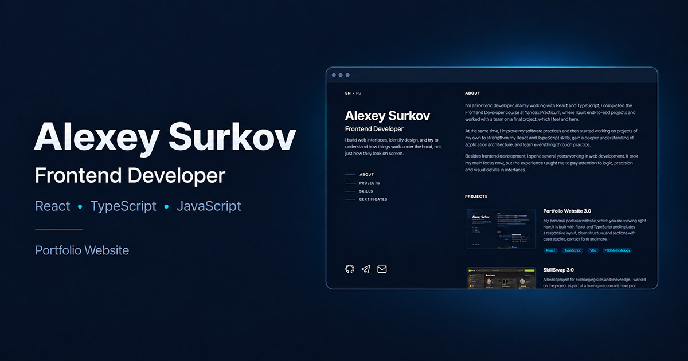

# Portfolio Website

My personal portfolio website built with React and TypeScript.

It presents my projects, skills and certificates and includes English and Russian content, responsive layouts and interaction states for desktop, keyboard and touch devices.

**Live demo:** [alexeydev42.github.io](https://alexeydev42.github.io/)



## Features

- responsive layout for desktop, tablet and mobile;
- English and Russian versions with persisted language selection;
- project cards with repository and live demo links;
- project and certificate previews using the native `dialog` element;
- active section navigation on desktop;
- sticky section headings on smaller screens;
- pointer-following spotlight effect on desktop;
- keyboard focus states and touch-specific interaction states;
- `prefers-reduced-motion` support;
- Open Graph and Twitter metadata for social link previews.

## Technical decisions

The site intentionally uses a simple component structure without a router or global state library. Portfolio content is stored as typed data and passed to presentation components through props.

CSS Modules are used for component styles, while shared CSS variables define colors, typography, spacing and other design values.

The desktop layout uses two columns with a sticky introduction panel. At smaller widths it switches to a single-column layout with sticky section headings.

The native HTML `dialog` element is used for project and certificate previews. Interactive states are separated for mouse, keyboard and touch input, and reduced-motion preferences are respected.

## Tech stack

- React 19
- TypeScript
- Vite
- CSS Modules
- SVGR
- Manrope
- ESLint
- Stylelint
- Prettier
- GitHub Pages

## Run locally

```bash
git clone https://github.com/alexeydev42/alexeydev42.github.io.git
cd alexeydev42.github.io
npm install
npm run dev
